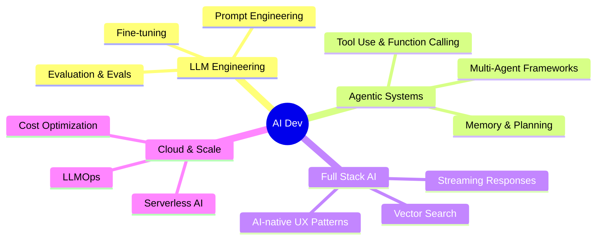

   
<!-- Typing SVG Header -->

## 🚀 What I Build

<table>
  <tr>
    <td align="center" width="200">
       
      Autonomous agents with tool use, memory & reasoning
    </td>
    <td align="center" width="200">
       
      Retrieval-augmented pipelines over private data
    </td>
    <td align="center" width="200">
       
      End-to-end AI-infused web applications
    </td>
    <td align="center" width="200">
       
      Scalable cloud-native AI infrastructure
    </td>
  </tr>
</table>

---

## 🛠️ Tech Stack

### 🤖 AI / ML

### 💻 Backend & APIs

### 🎨 Frontend

### 🗄️ Databases & Datastores

### ☁️ Cloud & DevOps

---

## 📊 GitHub Stats

  

---

## 🏆 Trophies

  

---

## 🌱 Currently Exploring

---

## 📬 Connect with Me

---

  
  
  ⚡ Crafting the future, one intelligent app at a time.

